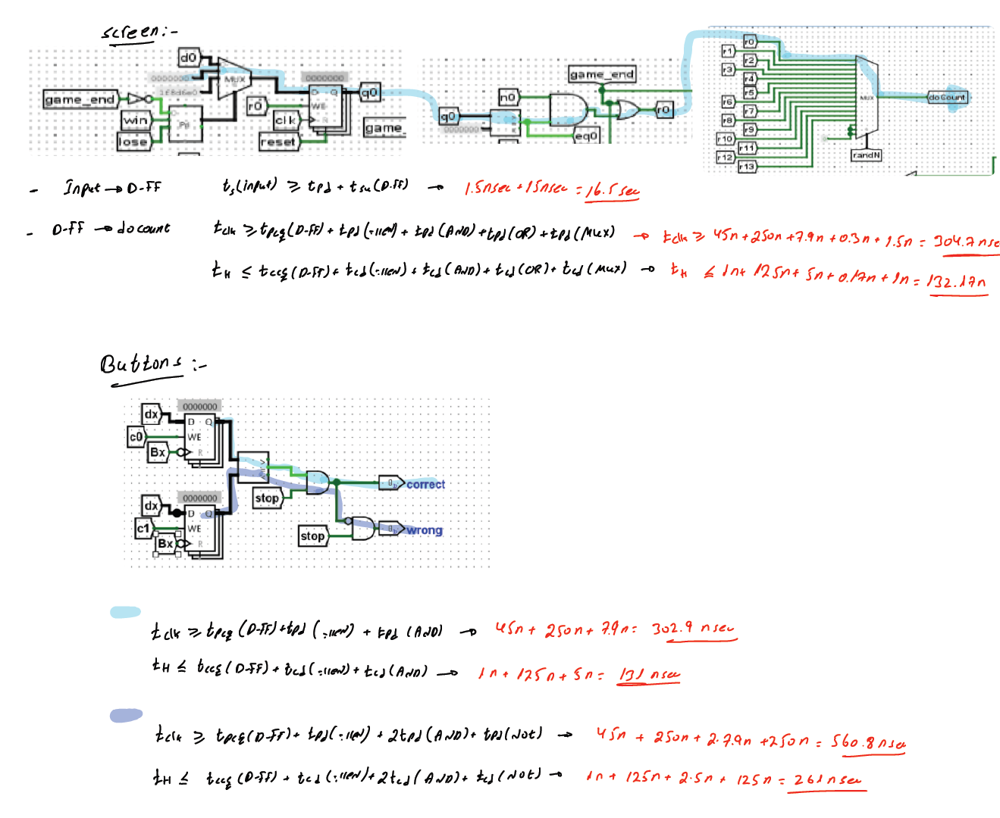
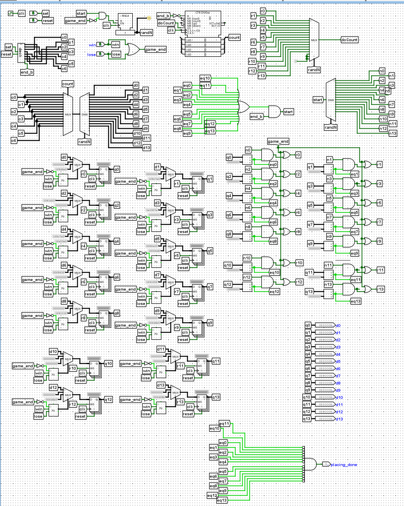
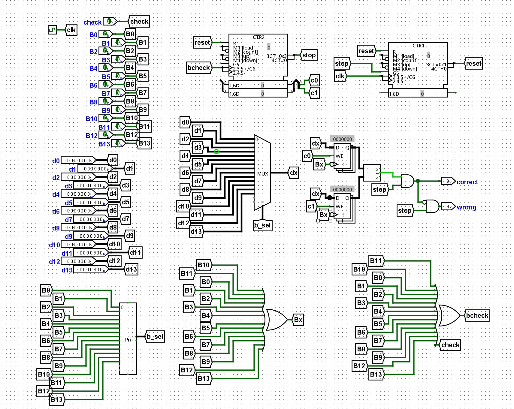
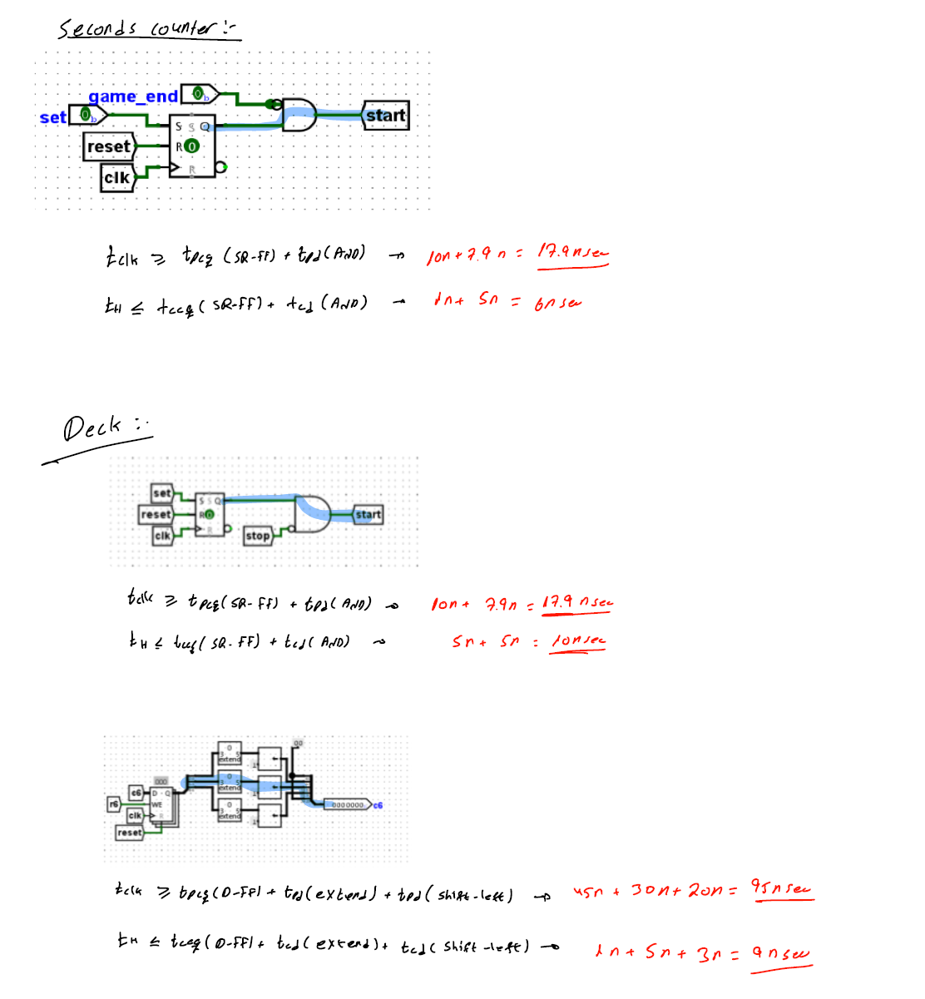
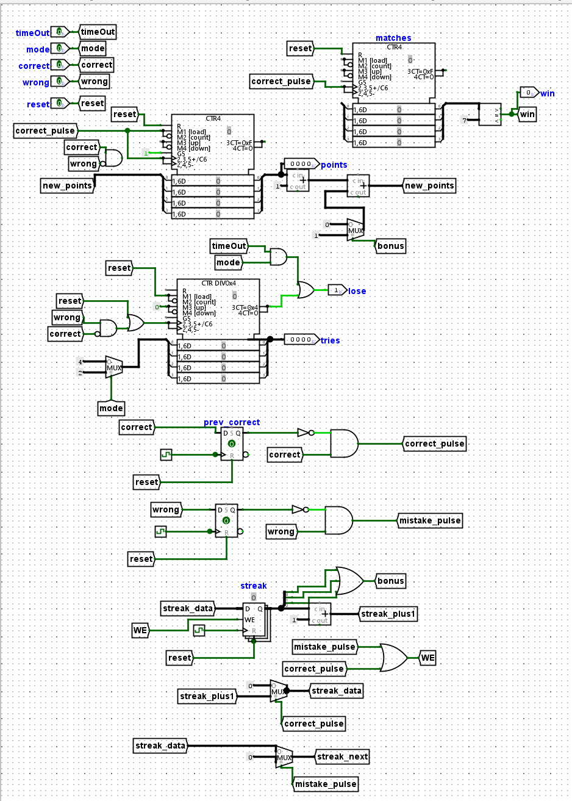

# Digital Memory Game in Logisim-Evolution

## Overview

Digital logic project implementing an interactive memory game in Logisim-Evolution with cards, score, timer, attempts, help logic, win/loss states, and sound feedback modules.

## Technical Highlights

- 14-card memory game with seven matching pairs.
- Easy and hard modes.
- Timer, attempts, score, combo/bonus logic.
- Modular hierarchy: main, screen, deck, score, timer, buttons, help, sound.
- Win/loss control and visual/audio feedback.

## Tech Stack

Logisim-Evolution, Digital Logic, FSM, Combinational Logic, Sequential Logic

## Results

- Full Logisim-Evolution `.circ` project included.
- The design separates input, control, display, scoring, timing, help, and sound subsystems.
- Documentation visuals show the implementation and simulation states.

## How to Run or Review

- Open `logisim/memory_game_final.circ` in Logisim-Evolution.
- Set the recommended simulation tick rate, reset the circuit, then start the game.

## Repository Notes

- This repository is prepared as a clean public GitHub portfolio version.
- Original course reports that contain student IDs or private details are not committed.
- The committed material focuses on source code, safe visuals, result screenshots, and a technical summary.

## Visuals

